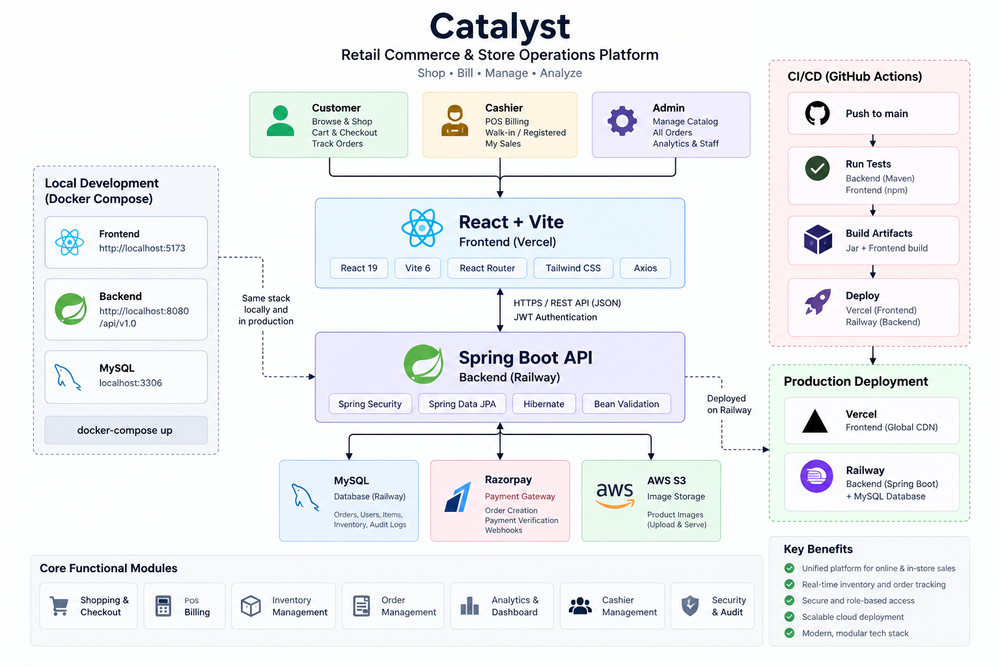

# Catalyst

# Catalyst — Retail Commerce & Store Operations Platform

A retail commerce and store operations platform with online shopping, point-of-sale billing, inventory management, payments, analytics, and administration.

## Live Demo

[Open Catalyst](https://catalyst-dun-two.vercel.app)

## Repository
[GitHub Repository](YOUR_GITHUB_REPO_URL)

## Overview

Catalyst serves three kinds of users from one backend and one web app:

- **Customers** register, browse the catalog, fill a cart, check out (cash or Razorpay), and track their orders.
- **Cashiers** bill in-store sales at the POS, either for a walk-in customer or for a registered customer they look up, and review their own sales.
- **Admins** manage the catalog, categories and cashier accounts, review every order (online and POS), and view the dashboard, analytics and system-wide activity log.

## Key Features

- **Shopping and checkout** – catalog with categories, cart, online checkout by CASH or UPI (Razorpay), and order history for customers.
- **POS** – cashier billing with either a walk-in customer (no account) or an explicitly selected registered customer; "My Sales" per cashier.
- **Inventory** – stock, reserved quantity and low-stock threshold per item, with server-side reservation, commit and release; admin stock adjustment.
- **Order management** – admins list all orders with server-side filtering, sorting and paging (including by cashier or customer). Orders are never deleted.
- **Dashboard and analytics** – revenue (PAID orders only), order counts and product/inventory views for admins.
- **Cashier management** – admins create cashiers, activate/deactivate them, reset passwords, and see per-cashier sales metrics.
- **Audit / activity log** – persistent, write-once log of meaningful state changes and security events. Each user sees their own; admins see all with filters.
- **Accounts** – every role can update its own name, email, mobile and password.
- **Security** – JWT auth, role-based access, ownership checks, server-side pricing (see [Security](#security)).

## User Roles

Exactly three roles exist; roles cannot be changed through any API.

| Role | Represents | Can do | Cannot do |
|---|---|---|---|
| `ROLE_USER` | Online customer | Shop, cart, checkout, own orders, own account and activity | POS, admin functions, other customers' data |
| `ROLE_CASHIER` | Store cashier | POS billing, own sales, own account and activity | Admin functions, shop/cart, other cashiers' sales |
| `ROLE_ADMIN` | Administrator | Dashboard, analytics, all orders, items, categories, cashiers, system activity | Create POS orders, use the customer shop/cart |

- Public registration always creates a `ROLE_USER`.
- Cashiers are created only by an admin.
- Admins are provisioned by a startup bootstrap (see [Environment Variables](#environment-variables)), never through an API.
- Accounts are never deleted; a departing cashier is deactivated, which blocks login and revokes existing tokens.

## Architecture



- **Frontend**: React 19 SPA built with Vite; role-aware routing and navigation.
- **Backend**: Spring Boot REST API with layers `controller → service interface → implementation → repository → entity`; request/response DTOs are separate from JPA entities.
- **Database**: MySQL, schema managed by Hibernate `ddl-auto=update` (no Flyway/Liquibase).
- **Auth**: stateless JWT, enforced by a Spring Security filter.
- **Integrations**: Razorpay for online payments; AWS S3 for item image uploads.

## Technology Stack

| Area | Technology |
|---|---|
| Backend | Java 21, Spring Boot 3.4.4, Spring Web, Spring Security, Spring Data JPA/Hibernate, Bean Validation, Lombok |
| Auth | JWT (jjwt), BCrypt |
| Database | MySQL (production), H2 (tests only) |
| Payments | Razorpay Java SDK, Razorpay Checkout on the client |
| Storage | AWS SDK v2 (S3) |
| Frontend | React 19, Vite 6, React Router 7, Axios, Tailwind CSS 4, Bootstrap 5, react-hot-toast |
| Testing | JUnit / Spring Boot Test / Spring Security Test (backend), Node's built-in test runner (frontend) |
| Tooling | Maven wrapper, ESLint, Docker, GitHub Actions |

## Security

- **JWT authentication** – bearer token; the subject is the normalized email. The filter reloads the account on every request and accepts the token only if the account is enabled and the token's `tokenVersion` matches the account's.
- **Session revocation** – `tokenVersion` is incremented on password reset, cashier deactivation, password change and email change, invalidating older tokens.
- **RBAC** – URL-level rules are centralized in `SecurityConfig`; hiding a link in the UI is not relied on.
- **Ownership** – enforced in the service layer from the authenticated principal. Customers see only orders linked to them; cashiers see only POS orders they created; no client-supplied id widens access.
- **Server-side pricing** – item price, subtotal, tax and total are computed on the backend from authoritative item data. Money is `BigDecimal` end to end; tax is 1% of subtotal, rounded half-up to 2 decimals.
- **Server-determined channel** – `salesChannel` (ONLINE/POS) comes from the endpoint, never from the request.
- **Passwords** – BCrypt-hashed; policy is 8–72 characters with at least one letter and one number. Login failures return one uniform `401` so account existence and status are not revealed.
- **Payment verification** – Razorpay signature is verified on the backend; see [Payment Flow](#payment-flow).
- **Inventory protection** – atomic updates prevent negative stock and double commit/release.
- **Errors and CORS** – a single JSON error shape with no stack traces; CORS uses an explicit origin allow-list (`*` is rejected at startup).

## Payment Flow

**Lifecycle** (invalid transitions are rejected; nothing is deleted):

```
PENDING_PAYMENT → PAID
PENDING_PAYMENT → PAYMENT_FAILED
PENDING_PAYMENT → CANCELLED
```

- **CASH** – the order is created already `PAID`; stock is reserved and committed in the same transaction.
- **UPI (Razorpay)** – the order is created as `PENDING_PAYMENT` and stock is reserved. The backend creates a Razorpay order for the server-side total (sent in paise). After the customer pays in Razorpay Checkout, the frontend sends the payment result to the backend, which checks that the Razorpay order id matches the stored one and cryptographically verifies the signature. Only then is the order marked `PAID` and reserved stock committed. Frontend success alone is never treated as proof of payment.
- Failure or cancellation releases the reservation. Repeated verify/cancel/fail requests do not double-commit or double-release.
- A `PENDING_PAYMENT` order older than 30 minutes is expired lazily (→ `PAYMENT_FAILED`, reservation released).
- Only the ONLINE order's customer, or the POS order's creating cashier, can drive that order's payment lifecycle.
- Order creation accepts an optional `Idempotency-Key` header so retries do not create duplicates.

## Inventory / POS

**Inventory** – each item tracks `stockQuantity`, `reservedQuantity`, `availableQuantity` (stock − reserved), `lowStockThreshold`, `active` and `sku`. Clients never supply stock.

**POS** – `POST /pos/orders` is cashier-only.

| | Registered customer | Walk-in customer |
|---|---|---|
| `user` | the customer selected via cashier-only lookup (`GET /pos/customers`) | none |
| `createdBy` | the cashier | the cashier |
| `salesChannel` | POS | POS |
| Customer visibility | appears in the customer's My Orders | not visible to any customer |

- A name or phone number that happens to match an account is never used to link an order; association only comes from explicit selection.
- No account is created for a walk-in customer.

## Testing

| Suite | Command (from) | Latest verified result |
|---|---|---|
| Backend | `.\mvnw.cmd test` (`billingsoftware/`) | 522 tests, 0 failures, 0 errors, 0 skipped (from the local Surefire reports, generated 2026-09-20) |
| Frontend | `npm test` (`client/`) | 34 tests passed, 0 failed (run on 2026-09-20) |

- Backend tests run on an H2 `test` profile with placeholder configuration; no MySQL or secrets are needed. They cover access control, JWT rejection, pricing, order/payment lifecycle, inventory reservation, idempotency, analytics, cashier management, audit logging and CORS.
- H2 does not reproduce MySQL/InnoDB locking semantics, so concurrency tests are not proof of production locking behavior.
- Frontend tests cover utility modules (cart, roles, session, validation, POS request building, Razorpay checkout options, etc.). The frontend lint and production build were not re-run for this README.

## Docker

`docker-compose.yml` at the repository root defines three services:

| Service | Image / build | Notes |
|---|---|---|
| `mysql` | `mysql:8.4` | Named volume `mysql-data`, with a health check |
| `backend` | `billingsoftware/Dockerfile` (Temurin 21 build → JRE 21 runtime) | Waits for MySQL to be healthy; port `8080`; uploads volume |
| `frontend` | `client/Dockerfile` (Node 22 build → nginx) | Serves the SPA on `${FRONTEND_PORT:-8081}` and proxies `/api/` to the backend |

Compose values come from the git-ignored root `.env`. The Docker MySQL is separate from any local MySQL.

## CI/CD

GitHub Actions (`.github/workflows/ci.yml`) runs on every push and pull request with read-only permissions:

- **Backend job** (Java 21, Temurin, Maven cache): `./mvnw -B test`, then `./mvnw -B -DskipTests package`. Tests use H2 with placeholder values.
- **Frontend job** (Node 22, npm cache): `npm ci`, `npm run lint`, `npm test`, `npm run build` (with a public placeholder `VITE_API_BASE_URL`).

The workflow does not deploy; it only verifies.

## Deployment

| Component | Platform |
|---|---|
| Frontend | Vercel |
| Backend | Railway |
| MySQL | Railway |

The frontend is built with `VITE_API_BASE_URL` pointing at the Railway backend's `/api/v1.0`, and the backend's `APP_CORS_ALLOWED_ORIGINS` lists the Vercel origin. The repository contains no Vercel or Railway configuration files; these platform settings live in the platforms themselves.

## Environment Variables

Secrets are supplied only through environment variables and are never committed. Copy the examples and fill in real values locally.

**Backend** (root `.env`, see `.env.example`):

| Group | Variables |
|---|---|
| Database | `DB_URL` (optional), `DB_USERNAME`, `DB_PASSWORD` |
| JWT | `JWT_SECRET_KEY` |
| Razorpay | `RAZORPAY_KEY_ID`, `RAZORPAY_KEY_SECRET` (backend only) |
| AWS S3 | `AWS_ACCESS_KEY`, `AWS_SECRET_KEY`, `AWS_REGION`, `AWS_BUCKET_NAME` |
| CORS / uploads | `APP_CORS_ALLOWED_ORIGINS`, `APP_UPLOADS_PUBLIC_BASE_URL`, `APP_UPLOADS_DIR` |
| Admin bootstrap | `APP_ADMIN_BOOTSTRAP_ENABLED`, `APP_ADMIN_NAME`, `APP_ADMIN_EMAIL`, `APP_ADMIN_MOBILE`, `APP_ADMIN_PASSWORD` |
| Docker only | `DOCKER_MYSQL_ROOT_PASSWORD`, `DOCKER_MYSQL_USER`, `DOCKER_MYSQL_PASSWORD`, `FRONTEND_PORT` |

**Frontend** (`client/.env.local`, see `client/.env.example`): `VITE_API_BASE_URL` (required for production builds) and `VITE_RAZORPAY_KEY_ID`. Every `VITE_` value is public in the browser bundle, so never put a secret there.

Admin bootstrap creates exactly one admin, only when enabled and no admin exists; with bootstrap enabled and missing/invalid values, startup fails. There are no default credentials.

## Local Development

Prerequisites: JDK 21, Node 22, and a running MySQL (database `billing_app` by default).

**Backend** – run from the repository root so `.env` is found:

```powershell
cd C:\Catalyst
.\billingsoftware\mvnw.cmd -f billingsoftware\pom.xml spring-boot:run
```

The API is served at `http://localhost:8080/api/v1.0`.

**Frontend**:

```bash
cd client
npm ci
npm run dev
```

The app is served at `http://localhost:5173` and falls back to `http://localhost:8080/api/v1.0` for the API.

**Docker Compose** (fill in the Docker and JWT values in `.env` first):

```bash
docker compose up --build
```

The app is served at `http://localhost:8081`.

## Production Notes

- **Razorpay UPI QR is not confirmed operational.** The checkout asks Razorpay to show its UPI options first, but Razorpay only offers UPI when it is enabled on the merchant account, and that account activation limitation remains. CASH checkout is unaffected.
- The database schema is managed by `ddl-auto=update`. It does not change existing column types, so a database created before the money columns became `DECIMAL(19,4)` keeps `DOUBLE` columns until converted manually (the app works with either).
- Expiry of stale `PENDING_PAYMENT` orders is lazy (triggered when an order touches the same items), not scheduled.
- Item images are uploaded to AWS S3 and require valid AWS configuration.